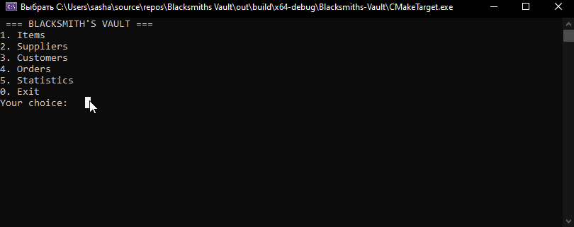

# ⚔️ Blacksmith's Vault

A console-based inventory management system for a fantasy blacksmith shop, built with C++ and SQLite3. Manage weapons, armor, potions, suppliers, customers, and orders — all persisted in a real relational database.



## 📋 Description

Blacksmith's Vault simulates the back-office of a medieval fantasy shop. The owner can track item stock, manage supplier relationships, process customer orders, and view sales statistics. The project demonstrates layered architecture, relational database design, and transaction-safe operations in C++.

## 🎯 Features

### 🗡️ Item Management
- ✅ Add, update, delete items (weapons, armor, potions)
- ✅ View full inventory with rarity, damage, durability, price, stock
- ✅ Filter items by **rarity** (common / uncommon / rare / legendary)
- ✅ Filter items by **type** (weapon / armor / potion)

### 🏭 Supplier Management
- ✅ Add, update, delete suppliers
- ✅ View all suppliers with origin and reliability rating
- ✅ Filter suppliers by **origin** (Elf / Dwarf / Human / etc.)

### 👥 Customer Management
- ✅ Add, update, delete customers
- ✅ Track **gold balance** per customer
- ✅ Filter customers by **guild**

### 📦 Order Management
- ✅ Create orders with **automatic price calculation** (item price × quantity)
- ✅ **Stock validation** — cannot order more than available
- ✅ **Balance validation** — cannot order if insufficient gold
- ✅ Cancel orders with **full stock and gold refund**
- ✅ Update order status (pending / completed / cancelled)
- ✅ Filter orders by **status**

### 📊 Statistics
- ✅ **Top 5 most popular items** — ranked by order count (SQL JOIN + GROUP BY)
- ✅ **Total profit** — sum of all completed orders (SQL SUM + WHERE)
- ✅ **Low stock alert** — items with fewer than 5 units remaining

## 🛠️ Technologies

- **C++17**
- **SQLite3** — embedded relational database
- **CMake** — build system

## 🏗️ Architecture

The project follows a layered architecture with clear separation of concerns:

```
Blacksmiths-Vault/
├── Blacksmiths-Vault.cpp     # Entry point
├── database/
│   ├── Database.h / .cpp     # Singleton connection manager + table initialization
├── models/
│   ├── Item.h / .cpp         # Data class + operator<< / operator>>
│   ├── Supplier.h / .cpp
│   ├── Customer.h / .cpp
│   └── Order.h / .cpp
├── repositories/
│   ├── ItemRepository.h / .cpp         # SQL CRUD for items
│   ├── SupplierRepository.h / .cpp
│   ├── CustomerRepository.h / .cpp
│   ├── OrderRepository.h / .cpp        # Transactional add/cancel
│   └── StatisticsRepository.h / .cpp  # Aggregate SQL queries
├── ui/
│   ├── Menu.h / .cpp         # Console menu and user interaction
│   └── InputHelper.h         # Template input validation helper
└── sqlite/
    ├── sqlite3.h
    └── sqlite3.c
```

**Layer responsibilities:**
- **Models** — plain data classes with getters/setters and overloaded `<<` / `>>` operators
- **Repositories** — all SQL logic isolated per entity; no SQL outside this layer
- **Database** — single Singleton that owns the `sqlite3*` connection and creates all tables on startup
- **UI** — reads user input, calls repositories, prints results; no SQL or business logic

## 💡 Key Technical Highlights

### Singleton Database Connection
```cpp
static Database& getInstance() {
    static Database instance;
    return instance;
}
```

### Transaction-Safe Order Creation
When a customer places an order, three operations happen atomically — or not at all:
```
BEGIN TRANSACTION
  INSERT INTO orders ...
  UPDATE items SET stock = stock - quantity
  UPDATE customers SET gold_balance = gold_balance - total_price
COMMIT   ← or ROLLBACK if any step fails
```

### Template Input Validation
```cpp
template<typename T>
T getInput(const std::string& prompt) {
    // loops until valid T is entered, handles cin.fail()
}
```

### Aggregate SQL Statistics
```sql
-- Top 5 items by order count
SELECT items.name, COUNT(orders.id) as order_count
FROM orders JOIN items ON orders.item_id = items.id
GROUP BY orders.item_id
ORDER BY order_count DESC
LIMIT 5;
```

## 🚀 How to Run

### Prerequisites
- CMake 3.16+
- C++17 compatible compiler (MSVC / GCC / Clang)
- SQLite3 (bundled in `/sqlite`)

### Build (CMake)
```bash
mkdir build && cd build
cmake ..
cmake --build .
./BlacksmithsVault
```

### Build (Visual Studio)
1. Open the folder in Visual Studio
2. Select `CMakeLists.txt` as the project
3. Press **F5**

> The database file `Blacksmith_database.db` is created automatically on first run.

## 📋 Example Usage

```
=== BLACKSMITH'S VAULT ===
1. Items
2. Suppliers
3. Customers
4. Orders
5. Statistics
0. Exit
Your choice: 4

What do you want to do with Orders?
1. Watch all orders
2. Add new order
...
Your choice: 2

Enter customer ID: 1
Enter item ID: 2
Enter quantity: 3
Total price: 124.5 gold
Enter order date (dd mm yyyy): 06 04 2026
Order added successfully!
```

```
=== Statistics ===
Top 5 most popular items:
1. Dragon Slayer Sword - 5 orders
2. Iron Shield - 3 orders
3. Health Potion - 2 orders

Total profit: 847.5 gold

Items with low stock (< 5):
- Elven Bow: 2 left
- Mithril Armor: 1 left
```

## 🎓 What I Learned

### Database & SQL
- Designing a normalized relational schema with foreign keys
- Writing parameterized queries to prevent SQL injection (`sqlite3_bind_*`)
- Using `SQLITE_TRANSIENT` vs `SQLITE_STATIC` for safe string binding
- Aggregate queries: `SUM`, `COUNT`, `GROUP BY`, `JOIN`, `ORDER BY`, `LIMIT`
- Transaction management: `BEGIN`, `COMMIT`, `ROLLBACK`
- SQLite Singleton connection pattern in C++

### C++ Design
- Repository pattern for clean separation of data access logic
- Singleton pattern (`Database`) for shared resource management
- Overloading `operator<<` and `operator>>` for model classes
- Template functions for type-safe console input (`getInput<T>`)
- `std::vector` for query results, `std::string` for text data

### Software Architecture
- Layered architecture: Models → Repositories → UI
- Header guards and proper include structure across a multi-folder project
- CMake configuration with `target_include_directories` for clean includes

## 🔧 Future Improvements

- [ ] Search items by name (partial match with SQL `LIKE`)
- [ ] Export statistics to CSV or JSON
- [ ] GUI version using Qt
- [ ] Unit tests with Google Test
- [ ] Authentication / multi-user support

## 📝 License

MIT License — free to use and modify.

## 👤 Author

**Oleksandr Kopii**  
GitHub: [@SamuraiSanch](https://github.com/SamuraiSanch)

---

⭐ If you found this project helpful, please give it a star!
